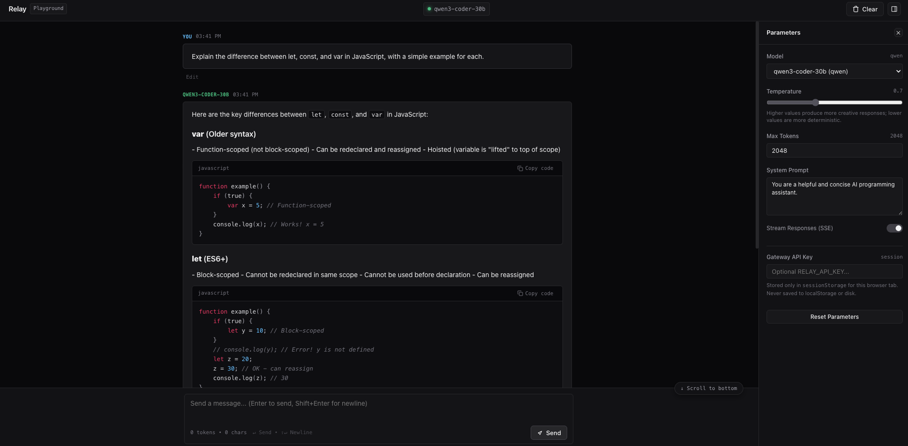

# Relay

> **One interface. Any model.**

Relay is a provider-agnostic LLM gateway and control plane built with Node.js, TypeScript, and Fastify. It exposes a unified, standard OpenAI-compatible API (`/v1/chat/completions`, `/v1/models`) and routes requests to heterogeneous upstream model backends—including Google Gemini, self-hosted vLLM servers (e.g., Qwen3-Coder), and configured OpenAI-compatible endpoints.

> [!NOTE]
> **Gateway, Not a Model**: Relay is not an LLM and does not train or host models internally. All inference runs inside your configured upstream providers or self-hosted GPU clusters. Relay serves as the resilience, routing, security, and observability layer sitting between your client applications and upstream inference engines.

```
                         Client (OpenAI SDK / HTTP)
                                     │
                                     ▼
                   ┌───────────────────────────────────┐
                   │               Relay               │
                   │    (Gateway & Control Plane)      │
                   └─────────────────┬─────────────────┘
                                     │
           ┌─────────────────────────┼─────────────────────────┐
           ▼                         ▼                         ▼
  ┌─────────────────┐       ┌─────────────────┐       ┌─────────────────┐
  │  Google Gemini  │       │  Qwen3-Coder    │       │ OpenAI-Compatible│
  │  (Cloud API)    │       │  (vLLM Server)  │       │ (Ollama, vLLM)  │
  └─────────────────┘       └─────────────────┘       └─────────────────┘
```

---

## Why Relay?

- **Eliminate Provider Lock-in**: Decouple client applications from specific vendor SDKs. Switch between hosted cloud APIs (Gemini) and self-hosted open-weights models (Qwen on vLLM) with configuration changes alone.
- **Failover & Resilience**: Automatically retry transient upstream errors against secondary fallback models without failing client requests.
- **Circuit Breaker Protection**: Detect and isolate consistently failing providers to avoid latency spikes and stop hammering downed backends.
- **Centralized Governance & Security**: Enforce optional Bearer token authentication, process-local rate limiting, SSRF safeguards, payload size limits, and credential leakage prevention in a single control plane.
- **Unified Telemetry**: Capture normalized request durations, token counts, error categories, and attempt counts across all providers.

---

## Core Capabilities

- **Standard OpenAI API Ingress**:
  - `POST /v1/chat/completions` supporting both JSON responses and Server-Sent Events (SSE) streaming.
  - `GET /v1/models` listing all configured models with capability metadata (context window, tool calling, vision).
  - `GET /v1/models/:model` for single-model inspection.
  - `GET /health` with cached upstream connectivity probes (`?refresh=true` supported).
- **Supported Provider Integrations**:
  - **Google Gemini**: Native adapter supporting configured Gemini models (such as `gemini-2.5-flash` and `gemini-2.5-pro`) and features supported by the provider contract (streaming, tool calling, vision, structured outputs).
  - **OpenAI-Compatible Backends**: Generic adapter compatible with configured OpenAI-compatible endpoints (designed to work with self-hosted vLLM, Ollama, LM Studio, or cloud providers such as Groq, Together, DeepSeek, and OpenAI). Relay operates purely as an API gateway consuming standard `/v1` endpoints and does not manage GPU hardware, CUDA drivers, or model lifecycles.
  - **Extensible Multi-Provider JSON**: Add arbitrary additional backends dynamically via `ADDITIONAL_PROVIDERS` without touching gateway code.
- **Collision-Safe Model Routing**:
  - **Exact Bare IDs**: Route unambiguous model names directly (e.g. `gemini-2.5-flash`).
  - **Qualified Identifiers**: Explicitly namespace colliding models across backends (e.g. `qwen/qwen3-coder-30b` vs `local-ollama/qwen3-coder-30b`).
  - **Logical Aliases**: Define business-tier aliases (e.g. `fast-coder`, `general-assistant`) that resolve cleanly to target models.
  - **Cycle & Loop Detection**: Detects and rejects circular alias definitions (`A -> B -> A`).
- **Resilience & Fallback Policies**:
  - **Selective Retry**: Retries transient upstream errors (502, 503, 504, connection drops) while failing fast on client errors (400, 401, 429).
  - **Streaming-Safe Fallback**: Retries fallback models if the primary fails before HTTP headers commit. Never corrupts streams by switching providers mid-generation.
  - **Global Timeout Budget**: All fallback attempts share a unified deadline (`REQUEST_TIMEOUT_MS`).
  - **Client Abort Propagation**: Cancelling a client request immediately signals upstream providers via `AbortSignal`, freeing GPU resources.
- **Circuit Breaker Foundation**:
  - Three-state state machine: `closed` $\to$ `open` $\to$ `half_open` $\to$ `closed`.
  - Trips when consecutive qualifying failures exceed a configurable threshold.
  - Bypasses open providers immediately, routing straight to configured fallbacks.
  - Limits concurrent probing during `half_open` health checks.
- **Traffic Protection & Security**:
  - Optional static Bearer token authentication (`RELAY_API_KEY`).
  - Fixed-window process-local rate limiter (`InMemoryRateLimiter`) with bounded memory and LRU key eviction.
  - SSRF protection preventing access to cloud metadata services (`169.254.169.254`) and unauthorized link-local addresses.
  - 10MB payload body limits and JSON parsing validation.
  - Strict credential hygiene: Bearer tokens, secrets, and raw prompts are excluded from logs and error shapes.
- **Usage & Observability Telemetry**:
  - Generates normalized `UsageRecord` metrics for every request (tokens, duration, provider, status, error code, attempts).
  - Pluggable `UsageSink` abstraction (`InMemoryUsageSink`, `NoopUsageSink`).

---

## Architecture

Relay enforces an inward dependency rule across its monorepo packages. Core domain contracts have zero external runtime dependencies.

```
┌─────────────────────────────────────────────────────────────┐
│                          apps/api                           │
│  Fastify HTTP Server, Ingress Routes, Auth & Rate Limiting  │
│  Hooks, Zod Configuration Schema, SSE Writer, CLI Process   │
└──────────────┬───────────────────────────────┬──────────────┘
               │                               │
               ▼                               │
┌──────────────────────────────┐               │
│      @relay/providers        │               │
│  Gemini & OpenAI Adapters,   │               │
│  ProviderRegistry, Router,   │               │
│  SSE Parser, Error Mappers   │               │
└──────────────┬───────────────┘               │
               │                               │
               ▼                               ▼
┌─────────────────────────────────────────────────────────────┐
│                        @relay/core                          │
│  Domain Types, Normalized Error Hierarchy, Provider Specs,  │
│  RateLimiter Contract & In-Memory Limiter, CircuitBreaker   │
│  Contract & State Machine, UsageRecord & UsageSink Specs    │
│                 (Zero Runtime Dependencies)                 │
└─────────────────────────────────────────────────────────────┘
```

See [docs/architecture.md](docs/architecture.md) for detailed lifecycle sequences and component diagrams.

---

## Quick Start

### Prerequisites

- **Node.js**: `v20.0.0` or newer (v22+ recommended).
- **pnpm**: `v9.0.0` or newer.

### 1. Installation

Clone the repository and install dependencies:

```bash
git clone https://github.com/mosabbir-maruf/Relay.git
cd Relay
pnpm install
```

### 2. Environment Configuration

Copy the example environment configuration:

```bash
cp .env.example .env
```

Edit `.env` with your provider keys or local inference endpoints:

```dotenv
# Port and Server (bind to loopback for local development)
PORT=3000
HOST=127.0.0.1
LOG_LEVEL=info

# Gateway Authentication (optional, leave blank for local development)
RELAY_API_KEY=

# Google Gemini (Optional)
GEMINI_API_KEY=your_gemini_api_key_here

# Generic vLLM Provider (Optional)
VLLM_BASE_URL=http://localhost:8000/v1
VLLM_MODEL=gpt2
```

> [!TIP]
> For local development, `HOST=127.0.0.1` binds Relay strictly to the loopback interface, and `RELAY_API_KEY` can be left unset. In production deployments exposed over a network, configure `HOST=0.0.0.0`, enforce `RELAY_API_KEY`, and place Relay behind a TLS-terminating reverse proxy or private network boundary.

### 3. Run Development Server

```bash
pnpm dev
```

The gateway will start at `http://localhost:3000`.

### 4. Run Test Suite & Build

```bash
# Run the test suite
pnpm test

# Check code formatting
pnpm run format:check

# Run linter
pnpm run lint

# Run strict TypeScript check across all packages
pnpm run typecheck

# Build all packages for production
pnpm build
```

---

## Self-Hosted Models (vLLM & OpenAI-Compatible)

Relay supports any self-hosted LLM inference backend adhering to the OpenAI REST API specification (`/v1/chat/completions` and `/v1/models`). This includes local runtimes (vLLM, Ollama, LM Studio), cloud GPUs (RunPod, Lambda Labs, Vast.ai), and containerized deployments.

### Turn-Key Deployment via Kaggle LLM Deployment Framework

For deploying open-weights Hugging Face models on free dual NVIDIA Tesla T4 GPUs (2× 16 GB nominal GDDR6, ~29.4 GiB usable VRAM) with automated hardware preflight validation and Cloudflare tunneling, use the companion framework:

**[Kaggle LLM Deployment Framework](https://github.com/mosabbir-maruf/kaggle-llm-deployment)**

- **Features**: Parameter-driven model selection, memory-aware preflight inspection (`preflight.py`), automatic processor dependency bootstrapping (`num2words` for SmolVLM2), idempotent process management (`vllm.sh`), dual-mode Cloudflare tunneling (`cloudflared.sh`), and 10-point diagnostics (`diagnostics.sh`).
- **Model Compatibility & Status**: See the [Model Roster & Status Matrix](https://github.com/mosabbir-maruf/kaggle-llm-deployment/blob/main/docs/supported-models.md) in the deployment repository for tested models across verification and configuration dimensions.
- **Relay Integration Runbook**: See [Self-Hosted Models in Relay](docs/self-hosted-models.md) and [OpenAI-Compatible & vLLM Setup](docs/openai-compatible-setup.md). Relay operates strictly as an upstream gateway consumer and does not manage model lifecycles or GPU hardware.

---

## Browser AI Playground

Relay includes a browser-based AI Playground built directly into the Fastify gateway at `/playground`. Built with vanilla TypeScript and ES modules—without the overhead or complexity of a frontend framework—it provides an interactive, dark-mode environment for prompt testing, model evaluation, and code generation directly through Relay's own OpenAI-compatible API.



> Browser-based AI Playground running Qwen3-Coder through the Relay gateway.

### Architecture Flow

```
Browser Playground
        │
        ▼  (Relative API: /v1/models, /v1/chat/completions, /health)
  Relay Gateway
        │
        ▼  (SSRF Protection, Rate Limiting, Circuit Breaking)
Configured Provider
        │
        ▼
Qwen / vLLM / Gemini / OpenAI-Compatible Backend
```

For self-hosted Qwen deployments, the upstream backend can be a Qwen3-Coder vLLM server running on Kaggle and exposed through an encrypted Cloudflare Quick Tunnel. The browser communicates exclusively with Relay's ingress endpoints; upstream provider URLs and credentials are never exposed to the client.

### Quick Start

Start the development server:

```bash
pnpm dev
```

Then open your browser to:

```text
http://localhost:3000/playground
```

The Playground communicates with Relay using relative API paths:

- `/v1/models` — Discovers configured models and capability metadata
- `/v1/chat/completions` — Executes non-streaming and streaming completions
- `/health` — Inspects live provider connectivity and latency

The browser never calls `VLLM_BASE_URL` or upstream backends directly.

### Configuration

The Playground relies on Relay's server-side environment configuration in `.env` (see the [Environment Configuration](#environment-configuration) table below):

```dotenv
VLLM_BASE_URL=https://<tunnel-subdomain>.trycloudflare.com/v1
VLLM_MODEL=gpt2
```

Upstream endpoint URLs and provider keys belong strictly in your local `.env` and are never hardcoded into client code. Cloudflare Quick Tunnel URLs are ephemeral and must be updated in `.env` whenever a new Kaggle session creates a new tunnel URL.

### Security Boundaries

- **UI Shell Isolation**: `/playground` serves the self-contained UI shell, while `/v1/*` endpoints maintain Relay's standard authentication behavior.
- **Session-Only Credentials**: If `RELAY_API_KEY` is configured on the gateway, credentials can be entered in the Playground settings panel. The key is stored strictly in browser `sessionStorage` for that tab and is never saved to `localStorage` or disk.
- **Zero Credential Exposure**: Server-side provider credentials (`GEMINI_API_KEY`, `VLLM_API_KEY`, upstream URLs) are never transmitted to or accessible from the browser.
- **Strict Content Security Policy**: Enforces `connect-src 'self'`, `frame-ancestors 'none'`, and `base-uri 'none'` to restrict network egress exclusively to the Relay gateway and block framing/clickjacking attacks.

### Feature Highlights

| Feature               | Description                                                                                |
| :-------------------- | :----------------------------------------------------------------------------------------- |
| **Model Discovery**   | Automatically populates available models from `GET /v1/models`                             |
| **Streaming Chat**    | Real-time Server-Sent Events (SSE) token streaming                                         |
| **Cancellation**      | Instant abort of active generation via `AbortController`                                   |
| **Health Status**     | Live connection status dot reflecting actual upstream backend reachability                 |
| **Markdown & Code**   | Safe scoped Markdown rendering with syntax-highlighted code blocks and one-click copy      |
| **Settings Controls** | Interactive controls for temperature, max tokens, system prompt, and streaming             |
| **Local Persistence** | Conversation history stored locally in browser `localStorage` (bounded to recent messages) |
| **Gateway Auth**      | Optional `RELAY_API_KEY` authentication supported via tab-scoped `sessionStorage`          |

---

## Environment Configuration

Configuration is validated at startup using Zod. The primary configuration options in `.env` are:

| Variable                            |   Type    |                   Default                   | Description                                                                       |
| :---------------------------------- | :-------: | :-----------------------------------------: | :-------------------------------------------------------------------------------- |
| `PORT`                              | `number`  |                   `3000`                    | HTTP port for the Fastify server.                                                 |
| `HOST`                              | `string`  |                  `0.0.0.0`                  | Network binding interface (`127.0.0.1` recommended for local development).        |
| `LOG_LEVEL`                         | `string`  |                   `info`                    | Logging verbosity (`fatal`, `error`, `warn`, `info`, `debug`, `trace`, `silent`). |
| `REQUEST_TIMEOUT_MS`                | `number`  |                   `60000`                   | Global request deadline in milliseconds.                                          |
| `RELAY_API_KEY`                     | `string`  |                   _empty_                   | Optional static Bearer token. When set, all `/v1/*` endpoints require auth.       |
| `GEMINI_API_KEY`                    | `string`  |                   _empty_                   | Google Gemini API key. Activates the Gemini provider when set.                    |
| `GEMINI_BASE_URL`                   | `string`  | `https://generativelanguage.googleapis.com` | Gemini API root URL.                                                              |
| `GEMINI_MODELS`                     | `string`  |           `gemini-2.5-flash,...`            | Comma-separated model IDs to register under Gemini.                               |
| `VLLM_BASE_URL`                     | `string`  |                   _empty_                   | Endpoint URL for self-hosted vLLM backend (e.g. `http://localhost:8000/v1`).      |
| `VLLM_MODEL`                        | `string`  |                   _empty_                   | Model name exposed by the generic vLLM backend (e.g. `gpt2`, `qwen2.5-coder-7b`). |
| `VLLM_API_KEY`                      | `string`  |                   _empty_                   | Optional API key for the vLLM backend.                                            |
| `OPENAI_COMPATIBLE_BASE_URL`        | `string`  |                   _empty_                   | Generic OpenAI-compatible endpoint URL (e.g. `http://localhost:11434/v1`).        |
| `OPENAI_COMPATIBLE_MODELS`          | `string`  |                   _empty_                   | Comma-separated list of models available on the generic backend.                  |
| `ADDITIONAL_PROVIDERS`              | `string`  |                   _empty_                   | JSON array of extra OpenAI-compatible backends.                                   |
| `ROUTING_POLICIES`                  | `string`  |                   _empty_                   | JSON array of logical aliases and fallback chains.                                |
| `RATE_LIMIT_ENABLED`                | `boolean` |                   `false`                   | Enable or disable process-local in-memory rate limiting.                          |
| `RATE_LIMIT_MAX_REQUESTS`           | `number`  |                    `100`                    | Max requests per key per window (process-local).                                  |
| `RATE_LIMIT_WINDOW_MS`              | `number`  |                   `60000`                   | Rate limit fixed window in milliseconds (1 minute).                               |
| `CIRCUIT_BREAKER_ENABLED`           | `boolean` |                   `false`                   | Enable or disable process-local upstream circuit breaking.                        |
| `CIRCUIT_BREAKER_FAILURE_THRESHOLD` | `number`  |                     `5`                     | Consecutive failures before tripping a provider circuit to `open`.                |
| `CIRCUIT_BREAKER_RESET_TIMEOUT_MS`  | `number`  |                   `30000`                   | Cooldown period before probing a failing provider in `half_open` state.           |

---

## API Examples

All examples assume Relay is running on `http://localhost:3000`.

### 1. Health & Upstream Connectivity Check

```bash
curl -X GET http://localhost:3000/health
```

**Example response (illustrative):**

```json
{
  "status": "healthy",
  "timestamp": "2026-09-17T04:00:00.000Z",
  "providers": {
    "gemini": {
      "isHealthy": true,
      "latencyMs": 145,
      "lastChecked": "2026-09-17T03:59:50.000Z"
    },
    "qwen": {
      "isHealthy": true,
      "latencyMs": 12,
      "lastChecked": "2026-09-17T03:59:50.000Z"
    }
  }
}
```

### 2. Discover Models

```bash
curl -X GET http://localhost:3000/v1/models
```

**Example response (illustrative):**

```json
{
  "object": "list",
  "data": [
    {
      "id": "gemini-2.5-flash",
      "object": "model",
      "created": 1726500000,
      "owned_by": "gemini",
      "capabilities": {
        "supportsStreaming": true,
        "supportsToolCalling": true,
        "supportsVision": true,
        "supportsStructuredOutput": true,
        "maxContextTokens": 1048576,
        "maxOutputTokens": 8192
      }
    },
    {
      "id": "qwen3-coder-30b",
      "object": "model",
      "created": 1726500000,
      "owned_by": "qwen",
      "capabilities": {
        "supportsStreaming": true,
        "supportsToolCalling": true,
        "supportsVision": false,
        "supportsStructuredOutput": true,
        "maxContextTokens": 32768,
        "maxOutputTokens": 4096
      }
    }
  ]
}
```

> [!NOTE]
> The capability metadata reflects the model/backend capability contract (for example, `maxContextTokens: 32768` for Qwen3-Coder-30B), while runtime deployments may constrain the context window further (such as self-hosted vLLM deployments that set `--max-model-len 4096` to conserve VRAM).

### 3. Non-Streaming Chat Completion

```bash
curl -X POST http://localhost:3000/v1/chat/completions \
  -H "Content-Type: application/json" \
  -d '{
    "model": "gemini-2.5-flash",
    "messages": [
      { "role": "system", "content": "You are a helpful assistant." },
      { "role": "user", "content": "Explain circuit breakers in one sentence." }
    ],
    "temperature": 0.7
  }'
```

**Example response (illustrative):**

```json
{
  "id": "chatcmpl-9abc123",
  "object": "chat.completion",
  "created": 1726500000,
  "model": "gemini-2.5-flash",
  "choices": [
    {
      "index": 0,
      "message": {
        "role": "assistant",
        "content": "A circuit breaker automatically stops routing requests to a failing service to prevent cascading failures."
      },
      "finish_reason": "stop"
    }
  ],
  "usage": {
    "prompt_tokens": 24,
    "completion_tokens": 19,
    "total_tokens": 43
  }
}
```

### 4. Streaming SSE Chat Completion

```bash
curl -N -X POST http://localhost:3000/v1/chat/completions \
  -H "Content-Type: application/json" \
  -d '{
    "model": "qwen3-coder-30b",
    "stream": true,
    "messages": [
      { "role": "user", "content": "Write a TypeScript function to check for primes." }
    ]
  }'
```

**Example SSE stream output (illustrative):**

```text
data: {"id":"chatcmpl-stream-1","object":"chat.completion.chunk","created":1726500000,"model":"qwen3-coder-30b","choices":[{"index":0,"delta":{"role":"assistant","content":"function"},"finish_reason":null}]}

data: {"id":"chatcmpl-stream-1","object":"chat.completion.chunk","created":1726500000,"model":"qwen3-coder-30b","choices":[{"index":0,"delta":{"content":" isPrime(n: number)"},"finish_reason":null}]}

data: [DONE]
```

---

## Model Aliases & Fallbacks

Relay allows defining stable logical model aliases and fallback chains via `ROUTING_POLICIES`:

```json
[
  {
    "model": "code-assistant",
    "primary": "qwen/qwen3-coder-30b",
    "fallbacks": ["gemini/gemini-2.5-flash"]
  }
]
```

When a client sends:

```json
{
  "model": "code-assistant",
  "messages": [{ "role": "user", "content": "Refactor this function" }]
}
```

1. Relay checks the circuit breaker for `qwen`. If healthy, it attempts `qwen3-coder-30b`.
2. If `qwen` fails with an upstream 502, 503, 504, or network timeout, Relay records the failure on the circuit breaker and transparently invokes the fallback `gemini/gemini-2.5-flash`.
3. The client receives a successful response, with `"model": "code-assistant"` preserved in the envelope.
4. If `qwen` is already `open` due to prior consecutive failures, Relay skips `qwen` entirely and routes directly to Gemini.

See [docs/routing-and-fallbacks.md](docs/routing-and-fallbacks.md) for full configuration details.

---

## Repository Structure

```
Relay/
├── apps/
│   └── api/                  # Fastify HTTP gateway application
│       ├── src/
│       │   ├── config/       # Environment schema and Zod validation
│       │   ├── hooks/        # Auth, rate-limiting, and request ID hooks
│       │   ├── routes/       # /health, /v1/models, /v1/chat/completions
│       │   ├── sse/          # Server-Sent Events stream writer
│       │   └── app.ts        # Fastify app factory
│       └── tests/            # End-to-end gateway integration tests
├── packages/
│   ├── core/                 # Core domain contracts, errors, rate limiter, breaker
│   │   ├── src/
│   │   │   ├── circuit-breaker/ # State machine and in-memory breaker
│   │   │   ├── errors/          # Normalized RelayError hierarchy
│   │   │   ├── rate-limiting/   # RateLimiter contract and fixed-window limiter
│   │   │   ├── routing/         # RoutingPolicy contract and error classifiers
│   │   │   └── telemetry/       # UsageRecord and UsageSink interfaces
│   │   └── tests/            # Pure unit tests for core primitives
│   └── providers/            # Upstream provider implementations
│       ├── src/
│       │   ├── gemini/          # Google Gemini provider adapter
│       │   ├── openai-compatible/ # Generic OpenAI & vLLM provider adapter
│       │   ├── registry/        # ProviderRegistry
│       │   └── routing/         # ModelRouter and alias resolution engine
│       └── tests/            # Provider and router test suite
├── docs/                     # Technical architecture and feature documentation
├── LICENSE                   # MIT License
└── package.json              # Monorepo workspace configuration
```

---

## Documentation Index

- [Architecture Overview](docs/architecture.md): Lifecycle diagrams, package layering, and design principles.
- [Self-Hosted Models Guide](docs/self-hosted-models.md): Integrating self-hosted endpoints with Relay, model aliasing, and Kaggle deployment workflows.
- [Model Routing, Aliases & Fallbacks](docs/routing-and-fallbacks.md): Policy configuration, cycle detection, and fallback mechanics.
- [Circuit Breaker Foundation](docs/circuit-breaker.md): State transitions, thresholds, and failure classification.
- [Rate Limiting](docs/rate-limiting.md): Fixed-window algorithm, keying strategies, headers, and memory limits.
- [OpenAI-Compatible & vLLM Setup](docs/openai-compatible-setup.md): Generic backend configuration, multi-provider JSON, and server setups.
- [Usage & Observability Telemetry](docs/telemetry.md): Telemetry data contract, sinks, and privacy boundaries.

---

## Current Limitations

Relay is deliberately designed with minimal external dependencies. Current architectural boundaries include:

- **Process-Local Rate Limiting**: The built-in rate limiter is in-memory. Counters reset on process restart and operate per-process across multi-instance clusters.
- **Process-Local Circuit Breaker**: Circuit state is tracked within each gateway process; distributed circuit state synchronization is not yet implemented.
- **Static Routing Policies**: Model aliases and fallback chains are loaded from configuration at startup. Dynamic runtime database updates are not yet supported.
- **In-Memory Telemetry**: The default `InMemoryUsageSink` retains records in process memory. Persistent storage is scheduled for the upcoming milestone.
- **Deterministic Routing**: Fallback policies are priority-ordered; dynamic latency or cost-based routing heuristics are not yet implemented.

---

## Roadmap

- [ ] **PostgreSQL & Supabase Usage Persistence**: Durable storage adapter for `UsageRecord` telemetry.
- [ ] **Cost Calculation & Spend Estimation**: Automated token pricing and cost modeling per model.
- [ ] **Telemetry Query APIs**: Auditing, token usage aggregation, and operational analytics endpoints.
- [ ] **Distributed Rate Limiting**: Optional Redis-backed rate limiter adapter.
- [ ] **Web Administration Dashboard**: Visual inspection of providers, circuit states, and real-time request metrics.

---

## License

Relay is open-source software licensed under the [MIT License](LICENSE).
