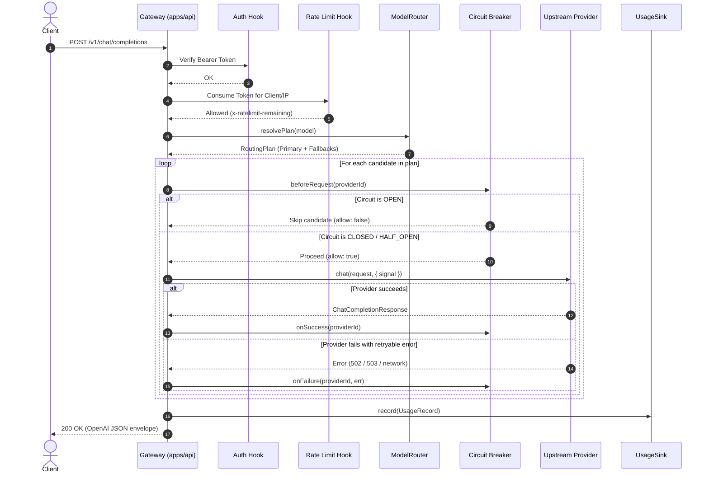

# Relay Architecture

Relay is a provider-agnostic LLM gateway and control plane built in TypeScript and Fastify. It normalizes communication between client applications using the OpenAI API standard and heterogeneous upstream inference backends (such as Google Gemini, local/self-hosted vLLM instances, and generic OpenAI-compatible APIs).

---

## 1. System Overview

```
                      Client (OpenAI SDK / HTTP)
                                  │
                                  ▼
                     ┌────────────────────────┐
                     │ Fastify Gateway Engine │ (apps/api)
                     └────────────┬───────────┘
                                  │
                  ┌───────────────┴───────────────┐
                  ▼                               ▼
       ┌─────────────────────┐         ┌─────────────────────┐
       │ Bearer Auth Hook    │         │ Rate Limiter Hook   │
       │ (RELAY_API_KEY)     │         │ (Fixed Window, LRU) │
       └──────────┬──────────┘         └──────────┬──────────┘
                  └───────────────┬───────────────┘
                                  │
                                  ▼
                     ┌────────────────────────┐
                     │      ModelRouter       │ (Exact, Qualified, Aliases)
                     └────────────┬───────────┘
                                  │
                                  ▼
                     ┌────────────────────────┐
                     │    Circuit Breaker     │ (Closed, Open, Half-Open)
                     └────────────┬───────────┘
                                  │
                  ┌───────────────┴───────────────┐
                  ▼                               ▼
       ┌─────────────────────┐         ┌─────────────────────┐
       │   GeminiProvider    │         │  OpenAICompatible   │
       │  (Google Gemini API)│         │ (vLLM, Ollama, APIs)│
       └──────────┬──────────┘         └──────────┬──────────┘
                  │                               │
                  ▼                               ▼
            Google Cloud                   Self-Hosted vLLM
          (gemini-2.5-flash)              (qwen3-coder-30b)
```

---

## 2. Package Layering & Dependency Hierarchy

Relay is structured as a strict monorepo managed with **pnpm** and **Turborepo**. Dependencies flow strictly inward to guarantee that core domain logic remains isolated from network transports and vendor SDKs.

```
┌─────────────────────────────────────────────────────────────┐
│                          apps/api                           │
│  Fastify HTTP Server, Ingress Routes, Auth & Rate Limiting  │
│  Hooks, Zod Configuration Schema, SSE Writer, CLI Process   │
└──────────────┬───────────────────────────────┬──────────────┘
               │                               │
               ▼                               │
┌──────────────────────────────┐               │
│      @relay/providers        │               │
│  Gemini & OpenAI Adapters,   │               │
│  ProviderRegistry, Router,   │               │
│  SSE Parser, Error Mappers   │               │
└──────────────┬───────────────┘               │
               │                               │
               ▼                               ▼
┌─────────────────────────────────────────────────────────────┐
│                        @relay/core                          │
│  Domain Types, Normalized Error Hierarchy, Provider Specs,  │
│  RateLimiter Contract & In-Memory Limiter, CircuitBreaker   │
│  Contract & State Machine, UsageRecord & UsageSink Specs    │
│                 (Zero Runtime Dependencies)                 │
└─────────────────────────────────────────────────────────────┘
```

### Dependency Rules

1. **`@relay/core`**:
   - Zero runtime dependencies.
   - Contains pure TypeScript interfaces (`LLMProvider`, `UsageSink`, `RateLimiter`, `CircuitBreaker`, `RoutingPolicy`).
   - Defines normalized error classes (`RelayError`, `RelayAuthenticationError`, `RelayRateLimitError`, `RelayProviderUnavailableError`, `RelayTimeoutError`).
   - Implements bounded in-memory primitives (`InMemoryRateLimiter`, `InMemoryCircuitBreaker`, `InMemoryUsageSink`).
2. **`@relay/providers`**:
   - Depends only on `@relay/core`.
   - Implements provider adapters (`GeminiProvider`, `OpenAICompatibleProvider`).
   - Implements `ProviderRegistry` and `ModelRouter`.
   - Free of HTTP gateway framework code (no Fastify dependencies).
3. **`apps/api`**:
   - Depends on `@relay/core` and `@relay/providers`.
   - Handles network transport, Fastify plugin registration, request authentication, rate-limiting hooks, and environment configuration.

---

## 3. End-to-End Request Lifecycle

### A. Non-Streaming Request (`POST /v1/chat/completions`)



### B. Streaming Request (`stream: true`)

Streaming requests use Server-Sent Events (SSE) with robust failure isolation:

1. **Pre-Stream Validation**: Before sending `HTTP 200 OK` headers, Relay initiates the stream from the primary candidate. If a retryable failure occurs prior to header commitment, Relay catches the error, records a circuit breaker failure, and attempts the fallback provider.
2. **Header Commitment**: Once the first chunk arrives or the stream begins, HTTP headers (`Content-Type: text/event-stream`, `Transfer-Encoding: chunked`) are committed to the client.
3. **Mid-Stream Protection**: If the upstream connection drops mid-stream after headers are sent, Relay emits an OpenAI-compatible SSE error event (`data: {"error": ...}\n\n`) and closes the connection cleanly. Relay never attempts fallback mid-stream to avoid interleaving responses from different models.
4. **Client Disconnect**: If the client closes the HTTP socket, an `AbortSignal` immediately cancels the upstream fetch request, halting token generation and freeing GPU resources.

---

## 4. Resilience & Traffic Safeguards

| Safeguard            | Implementation           | Behavior                                                                                                 |
| :------------------- | :----------------------- | :------------------------------------------------------------------------------------------------------- |
| **Authentication**   | `createAuthHook`         | Constant-time token verification; rejects invalid requests with HTTP 401 before routing.                 |
| **Rate Limiting**    | `InMemoryRateLimiter`    | Fixed-window with LRU key eviction; rejects flood traffic with HTTP 429 and `retry-after` header.        |
| **Circuit Breaking** | `InMemoryCircuitBreaker` | Trips to `open` after consecutive 502/503/timeout failures; bypasses failing backends immediately.       |
| **Fallback Routing** | `ModelRouter`            | Automatic failover to secondary models when the primary fails with retryable errors.                     |
| **Timeout Budget**   | `AbortController`        | Shared deadline across all fallback attempts; returns 504 on deadline expiry.                            |
| **SSRF Safeguards**  | Zod refine checks        | Enforces `http:`/`https:` schemes; blocks cloud metadata endpoints (`169.254.169.254`, Google metadata). |
| **Payload Limits**   | Fastify `bodyLimit`      | Strictly limits inbound JSON payloads to 10MB (`413 Payload Too Large`).                                 |
| **Secret Hygiene**   | Logging serializers      | Strips bearer tokens and authorization headers from logs, telemetry, and error payloads.                 |
