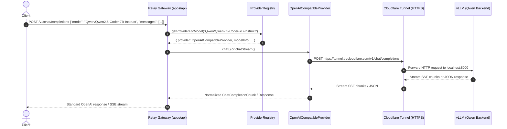

# OpenAI-Compatible & vLLM Backend Setup Guide for Relay

Relay supports any LLM inference backend adhering to the OpenAI REST API specification (`/v1/chat/completions` and `/v1/models`). This includes local self-hosted runtimes (Ollama, vLLM, LM Studio) and remote self-hosted GPU servers (such as vLLM running on Kaggle, RunPod, Lambda Labs, or dedicated hardware) connected directly or over secure tunnels (such as Cloudflare Tunnels).

---

## 1. Configuration Reference

Configure the provider in your local `.env` file:

| Environment Variable         |      Required?      | Default                     | Description                                                                                                                              |
| :--------------------------- | :-----------------: | :-------------------------- | :--------------------------------------------------------------------------------------------------------------------------------------- |
| `OPENAI_COMPATIBLE_BASE_URL` | **Yes** (to enable) | _None_                      | Target inference endpoint base URL (must point to the `/v1` prefix, e.g. `http://localhost:8000/v1` or `https://tunnel.example.com/v1`). |
| `OPENAI_COMPATIBLE_API_KEY`  |      Optional       | _None_                      | Sent as `Authorization: Bearer <token>`. Leave blank or omit for unauthenticated backends.                                               |
| `OPENAI_COMPATIBLE_MODELS`   |      Optional       | `openai-compatible-default` | Comma-separated list of model IDs available on the backend (e.g. `Qwen/Qwen2.5-Coder-7B-Instruct`).                                      |
| `OPENAI_COMPATIBLE_NAME`     |      Optional       | `openai-compatible`         | Friendly provider identifier for logs and model metadata.                                                                                |

> [!NOTE]
> When `OPENAI_COMPATIBLE_BASE_URL` is set, Relay automatically registers `OpenAICompatibleProvider` in its in-memory `ProviderRegistry`. When omitted, Relay runs with only other configured providers (such as Gemini).

---

## 2. Remote vLLM & Qwen Deployment

vLLM provides high-throughput, low-latency LLM serving with native PagedAttention and full OpenAI API compatibility.

### Launching vLLM with Qwen

Run vLLM on your GPU machine:

```bash
vllm serve Qwen/Qwen2.5-Coder-7B-Instruct \
  --host 0.0.0.0 \
  --port 8000 \
  --trust-remote-code \
  --max-model-len 8192 \
  --gpu-memory-utilization 0.95
```

If you require authentication on the vLLM server, add `--api-key <secret>`:

```bash
vllm serve Qwen/Qwen2.5-Coder-7B-Instruct \
  --host 0.0.0.0 \
  --port 8000 \
  --api-key my-vllm-secret-key
```

---

## 3. Remote Access via Cloudflare Tunnel

When your vLLM server runs in a private network, cloud VM, or Kaggle GPU notebook, Cloudflare Tunnels provide a fast, public HTTPS endpoint without port forwarding or firewall adjustments.

### A. Quick Tunnel (Development & Testing Only)

> [!WARNING]
> Cloudflare Quick Tunnels (`trycloudflare.com`) are temporary, ephemeral endpoints suitable only for testing. For persistent setups, use a Named Tunnel with a custom domain or a private network connection.

1. Install and start `cloudflared` on the GPU host:
   ```bash
   cloudflared tunnel --url http://localhost:8000
   ```
2. `cloudflared` outputs a temporary testing URL, e.g.:
   ```text
   Your quick Tunnel has been created! Visit it at:
   https://<temporary-id>.trycloudflare.com
   ```

### B. Named Tunnel (Production Custom Domain)

For persistent setups:

1. Create a named tunnel:
   ```bash
   cloudflared tunnel create vllm-relay
   ```
2. Route traffic to a DNS subdomain:
   ```bash
   cloudflared tunnel route dns vllm-relay qwen.yourdomain.com
   ```
3. Run the tunnel:
   ```bash
   cloudflared tunnel run --url http://localhost:8000 vllm-relay
   ```

---

## 4. Relay Configuration for vLLM

Set the variables in your local `.env`:

```dotenv
# Point to the backend URL with /v1 prefix (custom domain, internal IP, or local host)
OPENAI_COMPATIBLE_BASE_URL=https://qwen.yourdomain.com/v1
# (Or for local development: http://localhost:8000/v1)

# Optional API key (required only if vLLM was started with --api-key)
OPENAI_COMPATIBLE_API_KEY=your_optional_vllm_key

# Exact model name used when launching vLLM
OPENAI_COMPATIBLE_MODELS=Qwen/Qwen2.5-Coder-7B-Instruct

# Display name in /v1/models and logs
OPENAI_COMPATIBLE_NAME=vllm-qwen
```

---

## 5. End-to-End Request Flow

When Relay receives a request for a vLLM model:



1. **Routing**: `ProviderRegistry` identifies `Qwen/Qwen2.5-Coder-7B-Instruct` as bound to `OpenAICompatibleProvider`. No vendor-specific `if/else` logic is required in API routes.
2. **Payload Passthrough**: Relay translates the incoming request into standard OpenAI schema (`temperature`, `top_p`, `messages`, `stream`), and propagates the client's `AbortSignal`.
3. **Streaming & Buffering**: For `stream: true`, vLLM streams SSE chunks. Relay's `parseServerSentEvents` processes the chunks with zero buffering, feeding `writeSseStream` which immediately flushes them to the client.
4. **Timeout / Cancellation**: If the client closes the socket or the gateway timeout triggers, the abort signal propagates through the fetch pipeline, closing the connection to vLLM and releasing GPU memory.

---

## 6. Coexistence with Google Gemini

Both providers operate in parallel without interference:

```dotenv
# Gemini Configuration
GEMINI_API_KEY=your_gemini_api_key

# vLLM / OpenAI-Compatible Configuration
OPENAI_COMPATIBLE_BASE_URL=http://localhost:8000/v1
OPENAI_COMPATIBLE_MODELS=Qwen/Qwen2.5-Coder-7B-Instruct
```

- Requests for `gemini-2.5-flash` route to Google's API.
- Requests for `Qwen/Qwen2.5-Coder-7B-Instruct` route to the configured vLLM backend.
- `GET /v1/models` returns both models with their respective capabilities.

---

## 7. Dedicated Qwen Configuration

Relay provides dedicated configuration variables for Qwen backends, reusing the high-performance `OpenAICompatibleProvider` adapter under provider ID `qwen`:

```dotenv
# Qwen via vLLM
QWEN_BASE_URL=http://localhost:8000/v1
QWEN_MODEL=qwen3-coder-30b
# QWEN_API_KEY= (optional, leave unset if unauthenticated)
```

Any OpenAI-compatible backend can use the same provider abstraction, and Qwen through vLLM is a prime example. When configured:

- `OpenAICompatibleProvider` is registered in `ProviderRegistry` with ID `qwen`.
- The model `qwen3-coder-30b` is registered and exposed in `GET /v1/models` with `owned_by: "qwen"`.
- Ingress requests for `model: "qwen3-coder-30b"` route automatically to `QWEN_BASE_URL` with full streaming, cancellation, and error normalization support.

---

## 8. Dynamic Multi-Backend Configuration (`ADDITIONAL_PROVIDERS`)

To add additional self-hosted or third-party OpenAI-compatible endpoints without changing code, define `ADDITIONAL_PROVIDERS` as a JSON array in `.env`:

```dotenv
ADDITIONAL_PROVIDERS='[{"id":"deepseek","name":"DeepSeek","baseUrl":"https://api.deepseek.com/v1","apiKey":"sk-...","models":["deepseek-coder","deepseek-chat"]},{"id":"local-ollama","name":"Ollama","baseUrl":"http://localhost:11434/v1","models":["llama3.3:70b"]}]'
```

Each configured backend is automatically instantiated via `OpenAICompatibleProvider` and registered in `ProviderRegistry`.

---

## 9. Collision-Safe Routing & Model Resolution

Relay provides collision-safe routing:

1. **Bare Model Lookup**: If model ID is unique across providers (e.g. `qwen3-coder-30b`), querying `model: "qwen3-coder-30b"` resolves directly.
2. **Qualified Model Lookup**: If multiple providers serve the same model name (e.g. `llama3.3`), clients can qualify the request using `<provider>/<model>` (e.g. `local-ollama/llama3.3`).
3. **Ambiguity Protection**: When a collision occurs, querying the bare model name returns HTTP 400 with a detailed error listing all providers offering that model and instructing the client to use the qualified identifier.
4. **Single Model Inspection**: Clients can query `GET /v1/models/:model` to inspect a specific model's metadata and capabilities (returning HTTP 404 with OpenAI error shape if not found).

---

## 10. Production-Hardened Security & Reliability Features

- **SSRF Prevention**: All provider base URLs are validated to strictly enforce `http:` or `https:` protocols.
- **Request Body Limits**: Fastify ingress enforces a strict 10MB payload limit (`bodyLimit: 10485760`), returning HTTP 413 `payload_too_large` for oversized requests.
- **Pre-Stream Error Propagation**: For streaming requests (`stream: true`), Relay checks upstream responsiveness before sending HTTP 200 headers. Upstream failures (e.g. 401, 429, 502) return the authentic HTTP status code rather than a corrupt SSE stream.
- **Mid-Stream Error Recovery**: If an upstream connection terminates mid-stream after headers are committed, Relay emits an OpenAI-compatible SSE error event (`data: {"error": ...}\n\n`) and terminates cleanly.
- **Cached Health Checks**: Provider health checks are cached for 15 seconds to prevent hammering upstream inference servers. Operators can force an immediate check via `GET /health?refresh=true`.
- **Zero Secret Leakage**: API keys, bearer tokens, and sensitive authorization headers are excluded from logs, error envelopes, and telemetry events.
